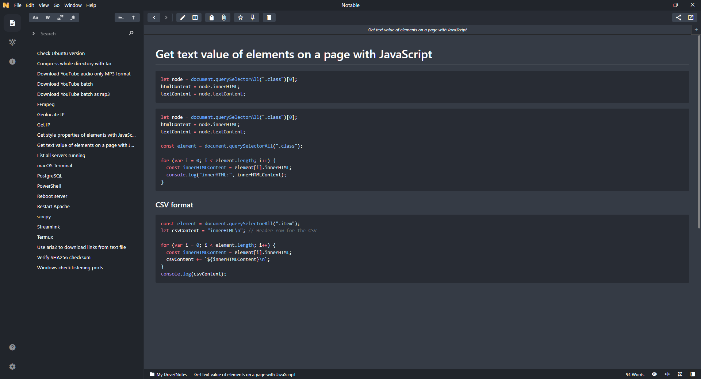

# One Dark Pro Theme for Notable

A custom CSS theme for the Notable app, inspired by the popular One Dark Pro color scheme. This theme brings a sleek, modern, and eye-friendly dark mode to your note-taking experience.

## Preview

## Installation

1. Download the `one-dark-pro.css` file.
2. Open Notable and go to **File > Preferences > Custom CSS/JS**.
3. Copy and paste the contents of `one-dark-pro.css` file into the CSS tab.
4. Enjoy the new look!

## Compatibility

This theme is designed and tested on **Notable v1.9.0-beta.10**. You can download this version from [this Reddit post](https://old.reddit.com/r/Notable/comments/ud118x/new_release_v190beta10/).

## Contributing

Feel free to open issues or submit pull requests for improvements. Contributions are welcome!
